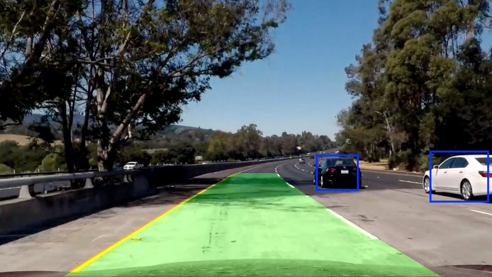
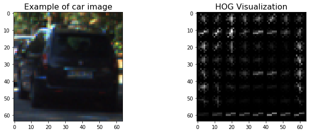
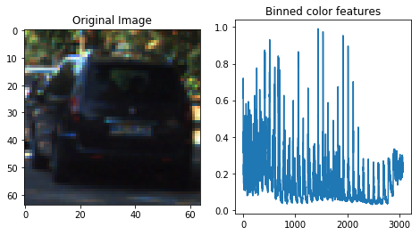
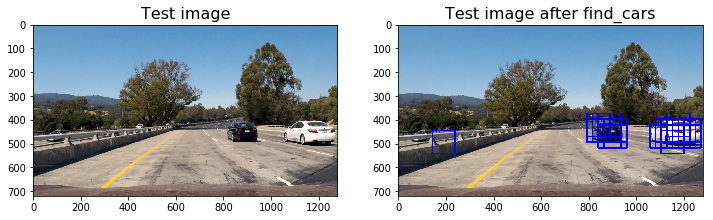

# Self-Driving Car Engineer Nanodegree

## **Vehicle detection and tracking** 



---

## Overview

In this project, I will write a software pipeline to identify vehicles in a video from a front-facing camera on a car. The test images and project video are available in the [project repository](https://github.com/miguelangel/sdc--vehicle-detection-and-tracking). 

The complete pipeline can be found [here](https://github.com/miguelangel/sdc--vehicle-detection-and-tracking/blob/master/vehicle_detection_and_tracking.ipynb).


## Goals/Steps
My pipeline consisted of 12 steps:


0. Import and initialize the packages needed in the project.
1. Implement a function that computes Histogram of Oriented Gradients (HOG) features from an image.
2. Implement a function that computes binned color features from an image.
3. Implement a function that computes color histogram features from an image.
4. Combine the previous feature extractors on a function
5. Extract features from the dataset, and split them in training and testing sets
6. Normalize the features 
7. Train a Linear SVM classifier.
8. Implement a sliding-window technique and use your trained classifier to search for vehicles in images.
9. Implement Hog Sub-sampling Window Search, a more efficient method for doing the sliding window
10. Handle multiple detections and false positives
11. Run pipeline in a video.

### Step 0: Import and initialize the packages needed in the project

It is not good to reinvent the wheel every time. That's why I have chosen to use some well known libraries:

- [OpenCV](https://opencv.org/) - an open source computer vision library,
- [Matplotbib](https://matplotlib.org/) - a python 2D plotting libray,
- [Numpy](http://www.numpy.org/) - a package for scientific computing with Python,
- [MoviePy](http://zulko.github.io/moviepy/]) - a Python module for video editing.
- [scikit-learn](http://scikit-learn.org/) - a Python machine learning library

The complete code for this step can be found in the first code cell of this [Jupyter notebook](https://github.com/miguelangel/sdc--vehicle-detection-and-tracking/blob/master/vehicle_detection_and_tracking.ipynb).

### Step 1: Implement a function that computes Histogram of Oriented Gradients (HOG) features from an image
The next step is to implement a function that computes Histogram of Oriented Gradients (HOG) features from an image.

Please find below the code and an example of its output, for both cars and non_cars images.

```python
# This function returns HOG features and visualization
# Features will always be the first element of the return
# Image data will be returned as the second element if visualize= True
# Otherwise there is no second return element
def get_hog_features(img, orient, pix_per_cell, cell_per_block, vis=False, feature_vec=True):
    """
    Function accepts params and returns HOG features (optionally flattened)
    and an optional matrix for visualization. Features will always be the
    first return (flattened if feature_vector= True).
    A visualization matrix will be the second return if visualize = True.
    """
    return_list = hog(img, orientations=orient, 
        pixels_per_cell=(pix_per_cell, pix_per_cell),
        cells_per_block=(cell_per_block, cell_per_block),
        block_norm='L2-Hys', transform_sqrt=True, 
        visualise=vis, feature_vector=feature_vec)
    
    if vis:
        hog_features = return_list[0]
        hog_image = return_list[1]
        
        return hog_features, hog_image
    else:
        hog_features = return_list
        
        return hog_features
```




### Step 2: Implement a function that computes binned color features from an image
The next step in hour pipeline is to compute binned color features from an image.

The function `bin_spatial()` performs that task.

The complete code for this step can be found in the 6th code cell of this [Jupyter notebook](https://github.com/miguelangel/sdc--vehicle-detection-and-tracking/blob/master/vehicle_detection_and_tracking.ipynb).

An example of the output of this function applied on the same car sample image is the following:




### Step 3: Implement a function that computes color histogram features from an image
Reading the title of this step, you already know what it comes: to implement a function to compyte color histogram features from an image. 

The function `color_hist` performs that task.

The complete code for this step can be found in the 8th code cell of this [Jupyter notebook](https://github.com/miguelangel/sdc--vehicle-detection-and-tracking/blob/master/vehicle_detection_and_tracking.ipynb).

An example of the output of this function applied on the same car sample image is the following:


### Step 4: Combine the previous feature extractors on a function
We now have three different feature sets. Each of them provides significative information about the image.

Therefore, let's combine the previous functions to return a single feature vector!

The function created for this task is named `single_img_features()` and can be found in the 10th cell of this [Jupyter notebook](https://github.com/miguelangel/sdc--vehicle-detection-and-tracking/blob/master/vehicle_detection_and_tracking.ipynb).

It is important to notice that each of the three kinds of features may be in different range of values. We will normalize the feature values in a later step.

### Step 5: Extract features from the dataset, and split them in training and testing sets
The next step will be to extract all the features from our dataset, and split them in training and testing sets.

The rationale behind having two different sets (training and testing) it is train on a set, but test in a different. This way, the possibility of overfitting (remembering) gets reduced, and the generalization model capabilities can be tested on an previously unseen dataset (testing set).

At this moment we will define the parameters to be used on this pipeline.

Indidual testing on the different functions, and also many many complete executions have helped me to choose this set of parameters for my pipeline. Please notice that it has been a try and error exercise.

```python
# Parameters
conv = 'RGB2YCrCb' # Can be '', 'RGB2HSV', 'RGB2HLS','RGB2LUV', 'RGB2YUV', 'RGB2YCrCb'
orient = 9
pix_per_cell = 8
cell_per_block = 2
hog_channel = 'ALL' # Can be 0, 1, 2, or "ALL"
spatial_size = (32, 32)
hist_bins = 32
spatial_feat=True 
hist_feat=True
hog_feat=True
y_start_stop=[350, 720]
scale=1.5
```

Below it can be observed the code used to extract features for car and non_car datasets. 

In addition to that, labels have been created ('1' for cars and '0' for non_cars).

Finally, scikit-learn's [train_test_split()](http://scikit-learn.org/stable/modules/generated/sklearn.model_selection.train_test_split.html) method have been used to explit our dataset in training and testing datasets, boths with its corresponding features and labels.

A 20% of the dataset have been used for testing purposes. Between 10% and 20% are typical values for this task.

It is important to notice that the dataset is balanced (similar number of car images and non-car images). In case it would not be, there is some chance that the model gets more influenced for one of the datasets. 

```python
# Extract features from car and non_car datasets
car_features = extract_features(car_images, conv=conv, orient=orient,
                pix_per_cell=pix_per_cell, cell_per_block=cell_per_block,
                hog_channel=hog_channel, spatial_size=spatial_size,
                hist_bins=hist_bins,
                spatial_feat=spatial_feat, hist_feat=hist_feat, hog_feat=hog_feat)
     

non_car_features = extract_features(non_car_images, conv=conv, orient=orient,
                pix_per_cell=pix_per_cell, cell_per_block=cell_per_block,
                hog_channel=hog_channel, spatial_size=spatial_size,
                hist_bins=hist_bins,
                spatial_feat=spatial_feat, hist_feat=hist_feat, hog_feat=hog_feat)
     

# Create features and labels dataset
features = np.vstack((car_features, non_car_features)).astype(np.float64)
car_labels = np.ones(len(car_features))
non_car_labels = np.zeros(len(non_car_features))
labels = np.concatenate((car_labels, non_car_labels))

# Split our dataset in training and testing sets
X_train, X_test, y_train, y_test = train_test_split(features, labels, test_size=0.2, random_state=23)

# Print the results
print ("The dataset is balanced:")
print ("- Number of car_images:", len(car_images))
print ("- Number of non_car images:", len(non_car_images))
print ()
print ("Number of samples:")
print ("- In training set:", X_train.shape[0])
print ("- In testing set:", X_test.shape[0])
print ()
print ("X_train before normalization:")
print (X_train)
```

    The dataset is balanced:
    - Number of car_images: 8792
    - Number of non_car images: 8968
    
    Number of samples:
    - In training set: 14208
    - In testing set: 3552
    
    X_train before normalization:
    [[3.08707506e+00 4.19965387e+00 3.36480241e+00 ... 2.00000000e+00
      1.00000000e+00 1.00000000e+00]
     [9.63635863e-01 9.14975433e-01 4.29694887e-01 ... 3.01000000e+02
      3.00000000e+01 2.00000000e+00]
     [1.50244423e-01 1.92732623e+00 2.59159382e+00 ... 2.10000000e+01
      8.00000000e+00 9.00000000e+00]
     ...
     [7.06921784e-01 7.10933400e-01 8.05957277e-01 ... 7.30000000e+01
      3.50000000e+01 1.80000000e+01]
     [3.41430176e+01 2.41606968e+01 1.19264415e+01 ... 2.00000000e+01
      9.00000000e+00 8.00000000e+00]
     [2.23211897e+00 8.73491692e-01 1.99946206e+00 ... 1.00000000e+00
      1.00000000e+00 1.00000000e+00]]


### Step 6: Normalize the features
Now that we have our training and testing datasets, we are in a position to normalize the features.

Please notice that only the training dataset is used to fit our scaler, in this case sklearn's [StandardScaler](http://scikit-learn.org/stable/modules/generated/sklearn.preprocessing.StandardScaler.html). The rational behind this is similar than before. We don't want the testing data to influence our model.

Once trained the scaler, both, training and testing data are normalized.

Please find below the corresponding code.

Notice that, after normalization, the mean is zero and the variance quite close to one.

```python
# Fit a per-column scaler only on the training data
X_scaler = StandardScaler().fit(X_train)

# Apply the scaler to both X_train and X_test
X_train = X_scaler.transform(X_train) 
X_test = X_scaler.transform(X_test)

# Print the results
print("X_train after normalization:")
print(X_train)
print()
scaled_features = np.vstack((X_train, X_test))
print("Features mean after normalization: {:.2f}".format(np.mean(scaled_features)))
print("Features variance after normalization: {:.2f}".format(np.var(scaled_features)))

```

    X_train after normalization:
    [[-0.21000089 -0.09525187 -0.17952292 ... -0.39258294 -0.28674865
      -0.20324975]
     [-0.32161663 -0.329339   -0.35798521 ...  0.99993889 -0.17602141
      -0.19715035]
     [-0.36437147 -0.25719243 -0.22653605 ... -0.30409493 -0.26002138
      -0.15445456]
     ...
     [-0.33511046 -0.34388034 -0.33510747 ... -0.06191722 -0.1569305
      -0.09955997]
     [ 1.42241323  1.32729931  0.34104736 ... -0.30875219 -0.2562032
      -0.16055396]
     [-0.25494051 -0.33229539 -0.26253922 ... -0.3972402  -0.28674865
      -0.20324975]]
    
    Features mean after normalization: 0.00
    Features variance after normalization: 1.03


### Step 7: Train a Linear SVM classifier
In this step we are ready to train our model, in this case using Support Vector Machine classifier.

Default values have been used to train it. After training, it's accuracy is 98.85% (not bad at all!).

```python
# Use a linear SVC 
svc = LinearSVC()


# Check the training time for the SVC
t=time.time()
clf = svc.fit(X_train, y_train)

t2 = time.time()
print(round(t2-t, 2), 'Seconds to train LinearSVC...')

# Check the score of the SVC
print('Test Accuracy of LinearSVC = ', round(clf.score(X_test, y_test), 4))

# Check the prediction time for a single sample
t=time.time()
n_predict = 10
print('My LinearSVC predicts: ', clf.predict(X_test[0:n_predict]))
print('For these',n_predict, 'labels: ', y_test[0:n_predict])
t2 = time.time()
print(round(t2-t, 5), 'Seconds to predict', n_predict,'labels with LinearSVC')
```

    14.92 Seconds to train LinearSVC...
    Test Accuracy of LinearSVC =  0.9885
    My LinearSVC predicts:  [0. 0. 0. 1. 1. 0. 1. 0. 0. 1.]
    For these 10 labels:  [0. 0. 0. 1. 1. 0. 1. 0. 0. 1.]
    0.00082 Seconds to predict 10 labels with LinearSVC


### Step 8: Implement a sliding-window technique and use your trained classifier to search for vehicles in images
This step implements a basic sliding-window technique. 

An in-depth explanation about how these functions work can be found at the [Lesson 20: Object detection](https://classroom.udacity.com/nanodegrees/nd013/parts/fbf77062-5703-404e-b60c-95b78b2f3f9e/modules/2b62a1c3-e151-4a0e-b6b6-e424fa46ceab/lessons/05b03f20-8c4b-453c-b41e-9fac590278c7/concepts/169c67e2-32dd-4df2-b338-0eca85ef18d6) of Udacity's [Self Driving Car Engineer Nanodegree](https://www.udacity.com/course/self-driving-car-engineer-nanodegree--nd013). 

I have copied below the result of applying this technique over a sample image:


The complete code for this step can be found in the cells 16 to 19 of this [Jupyter notebook](https://github.com/miguelangel/sdc--vehicle-detection-and-tracking/blob/master/vehicle_detection_and_tracking.ipynb).

### Step 9: Implement Hog Sub-sampling Window Search, a more efficient method for doing the sliding window
This step implements a more efficietn method for doing the sliding window.

An in-depth explanation about how these functions work can be found at the [Lesson 20: Object detection](https://classroom.udacity.com/nanodegrees/nd013/parts/fbf77062-5703-404e-b60c-95b78b2f3f9e/modules/2b62a1c3-e151-4a0e-b6b6-e424fa46ceab/lessons/05b03f20-8c4b-453c-b41e-9fac590278c7/concepts/c3e815c7-1794-4854-8842-5d7b96276642) of Udacity's [Self Driving Car Engineer Nanodegree](https://www.udacity.com/course/self-driving-car-engineer-nanodegree--nd013). 

I have copied below the result of applying this technique over a sample image:



The complete code for this step can be found in the cells 20 and 21 of this [Jupyter notebook](https://github.com/miguelangel/sdc--vehicle-detection-and-tracking/blob/master/vehicle_detection_and_tracking.ipynb).


### Step 10: Handle multiple detections and false positives
The objective of this step is to reduce the number of false possitives. To do that, a heat zone is calculated based on the number of car detected by the pipeline.

If the number of car detected on a specific area is greater than a threshold, then that area is considered to contain a car on it.

Please notice that this is an useful technique, but it still identifies false possitives as cars.

In the pipeline has been used this technique alonside to a history of heat zones that reduces significantly the number of false positives.

The code can be found below, and an example of its execution too.

```python
# This function adds "heat" to a map for a list of bounding boxes
def add_heat(heatmap, bbox_list):
    # Iterate through list of bboxes
    for box in bbox_list:
        # Add += 1 for all pixels inside each bbox
        # Assuming each "box" takes the form ((x1, y1), (x2, y2))
        heatmap[box[0][1]:box[1][1], box[0][0]:box[1][0]] += 1

    # Return updated heatmap
    return heatmap 

# This function zero outs heatmap pixels which are below a threshold 
def apply_threshold(heatmap, threshold):
    # Zero out pixels below the threshold
    heatmap[heatmap <= threshold] = 0
    # Return thresholded map
    return heatmap

def draw_labeled_bboxes(img, labels):
    # Iterate through all detected cars
    for car_number in range(1, labels[1] + 1):
        # Find pixels with each car_number label value
        nonzero = (labels[0] == car_number).nonzero()

        # Identify x and y values of those pixels
        nonzeroy = np.array(nonzero[0])
        nonzerox = np.array(nonzero[1])
        
        # Define a bounding box based on min/max x and y
        bbox = ((np.min(nonzerox), np.min(nonzeroy)), (np.max(nonzerox), np.max(nonzeroy)))
        
        # Draw the box on the image
        cv2.rectangle(img, bbox[0], bbox[1], (0,0,255), 6)

    # Return the image
    return img

```


```python
# Add heat to each box in box list
heat = np.zeros_like(img[:,:,0]).astype(np.float)
heat = add_heat(heat, box_list)
    
# Apply threshold to help remove false positives
heat = apply_threshold(heat, 1.2)

# Visualize the heatmap when displaying    
heatmap = np.clip(heat, 0, 255)

# Find final boxes from heatmap using label function
labels = label(heatmap)
draw_img = draw_labeled_bboxes(np.copy(img), labels)


plt_images(draw_img, 'Car positions', heatmap, 'Heat map', cmap='hot')
```


### Step 11: Run pipeline in a video
This is the final step in our pipeline.

In this step, we will use all the previous steps to create a pipeline that can be used on a video.

The first thing I have done is to create the `ProcessImage` class. I have decided to use a class instead of a method because it would let me keep track of the previously detected heat zones and also store the pipeline parameters.

Please notice that this is a very basic implementation. Nevertheless, I have added a kind of _buffer_ of boxes found by our `find_cars()` method. If the buffer contains enough evidences that a car is present in a specific zone of the image, then it is displayed a box around it.


```python
class ProcessImage:
    def __init__(self, 
        y_start_stop, scale, clf, X_scaler, conv='', orient=9, 
        pix_per_cell=8, cell_per_block=2, hog_channel='ALL', spatial_size=(32, 32), 
        hist_bins=32,                           
        spatial_feat=False, hist_feat=False, hog_feat=True):

        # Save init parameters
        self.y_start_stop=y_start_stop
        self.scale=scale
        self.clf=clf
        self.X_scaler=X_scaler
        self.conv=conv
        self.orient=orient
        self.pix_per_cell=pix_per_cell
        self.cell_per_block=cell_per_block
        self.hog_channel=hog_channel
        self.spatial_size=spatial_size
        self.hist_bins=hist_bins
        self.spatial_feat=spatial_feat
        self.hist_feat=hist_feat
        self.hog_feat=hog_feat

    def __call__(self, img):
        # Scaled from [0, 255] to [0,1]
        img_scaled = np.copy(img).astype(np.float32)/255

        # Find cars in the image        
        _ , box_list = find_cars(img_scaled, self.y_start_stop, self.scale, self.clf,
                    self.X_scaler, conv=self.conv, orient=self.orient, 
                    pix_per_cell=self.pix_per_cell, cell_per_block=self.cell_per_block,
                    hog_channel=self.hog_channel,spatial_size=self.spatial_size,
                    hist_bins=self.hist_bins, 
                    spatial_feat=self.spatial_feat, hist_feat=self.hist_feat, hog_feat=self.hog_feat)
        
        # Add heat to each box in box list
        heat = np.zeros_like(img[:,:,0]).astype(np.float)
        heat = add_heat(heat, box_list)

        # Apply threshold to help remove false positives
        heat = apply_threshold(heat, 1.2)

        # Visualize the heatmap when displaying    
        heatmap = np.clip(heat, 0, 255)

        # Find final boxes from heatmap using label function
        labels = label(heatmap)
        
        out_img = draw_labeled_bboxes(np.copy(img), labels)
        
        # Return image            
        return out_img
```

I have used MoviePy's [VideoFileClip](https://zulko.github.io/moviepy/_modules/moviepy/video/io/VideoFileClip.html) class to read the input video. Then, I have used [fl_image](https://zulko.github.io/moviepy/ref/VideoClip/VideoClip.html#moviepy.video.VideoClip.VideoClip.fl_image) to process each frame with our `ProcessImage` class. 

Finally, I have written the output video usign 'https://zulko.github.io/moviepy/ref/VideoClip/VideoClip.html#moviepy.video.VideoClip.VideoClip.write_videofile' 


```python
# Parameters
conv = 'RGB2YCrCb' # Can be '', 'RGB2HSV', 'RGB2HLS','RGB2LUV', 'RGB2YUV', 'RGB2YCrCb'
orient = 9
pix_per_cell = 8
cell_per_block = 2
hog_channel = 'ALL' # Can be 0, 1, 2, or "ALL"
spatial_size = (32, 32)
hist_bins = 32
spatial_feat=True 
hist_feat=True
hog_feat=True
y_start_stop=[350, 720]
scale=1.5


input_video = './project_video.mp4'
output_video = './project_video_solution.mp4'

## You may uncomment the following line for a subclip of the first 5 seconds
clip1 = VideoFileClip(input_video).subclip(15,18)
#clip1 = VideoFileClip(input_video)

# Process video frames with our 'process_image' function


process_image = ProcessImage(y_start_stop, scale, clf, X_scaler, conv=conv, orient=orient, 
                    pix_per_cell=pix_per_cell, cell_per_block=cell_per_block, hog_channel=hog_channel,
                    spatial_size=(spatial_size), hist_bins=hist_bins, 
                    spatial_feat=spatial_feat, hist_feat=hist_feat, hog_feat=hog_feat)

white_clip = clip1.fl_image(process_image)

%time white_clip.write_videofile(output_video, audio=False)

```

The output video can be found [here](https://github.com/miguelangel/sdc--vehicle-detection-and-tracking/blob/master/project_video_solution.mp4).

## Discussion

This has been a really challenging project and I am quite happy with the results.

 Nevertheless, there is still some room for improvements in the `ProcessImage` class:

- I should tune a bit more my `find_cars()` function and the _buffered heat zone mechanishim_ (I have just made up that name) to perform an even more reliable car detection.
- 
I will implement these changes in the future, but today is my last day to submit the project, so I have decided to leave it for the next weeks.

I really hope you have enjoyed this lecture as much as I have done writting it for you.

